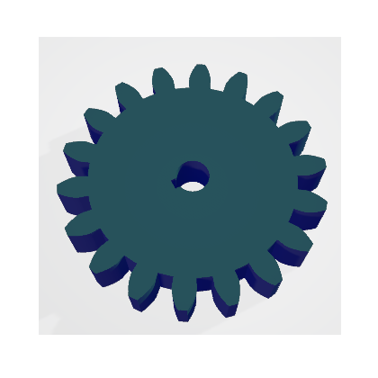
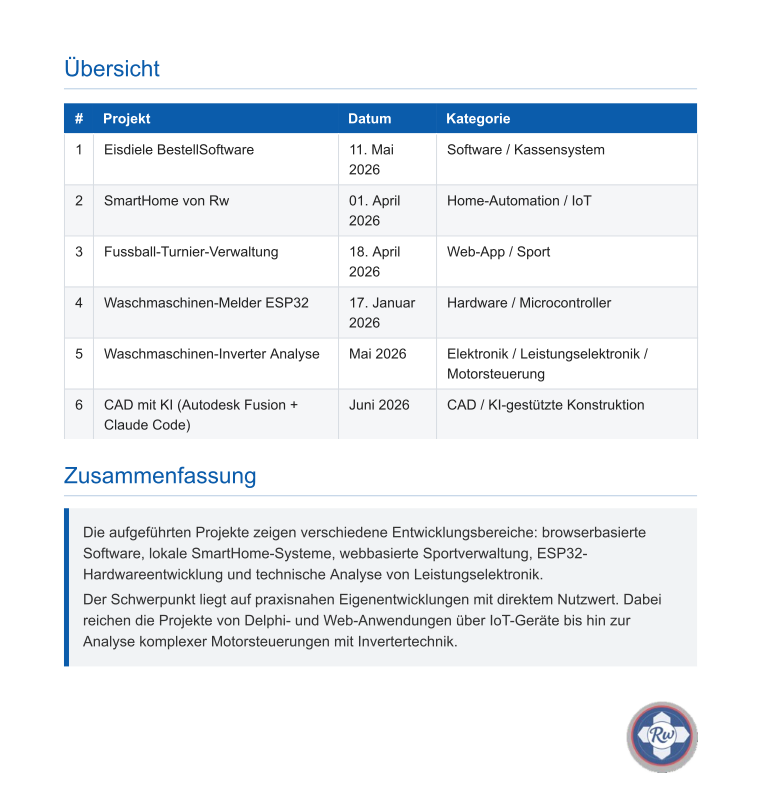

# konstruktionrw  

## Abhandlung:

Konstruieren mit CAD + Künstliche Intelligenz als 3d-Druck/Metalldruck erstellt
- Autodesk Fusion 360
- Ki"Claude"

verwendet.
## AusgangsLage...Szenario

Bei einem defekten Bauteil einer Maschine die für die Produktion wichtig ist, und nicht auf Lager war,
haben wir auf diesen Wege **CAD mit Autodesk + Ki"Claude"-Unterstützung** dieses Problem gelöst!

## Projekte Übersicht

